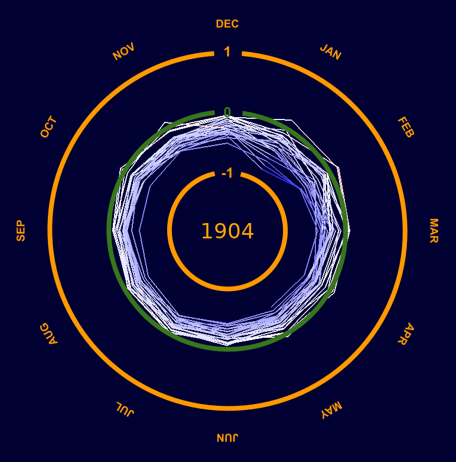

# Climate Spiral

After watching The Coding Train (https://thecodingtrain.com/challenges/178-climate-spiral) use p5.js to  
recreate the climate spiral as visualized on https://edhawkins.org/ I decided to try it myself using pygame.  

To try it yourself, `pip install pygame` in your favorite python virtual environment, and run  
`python spiral.py`.
